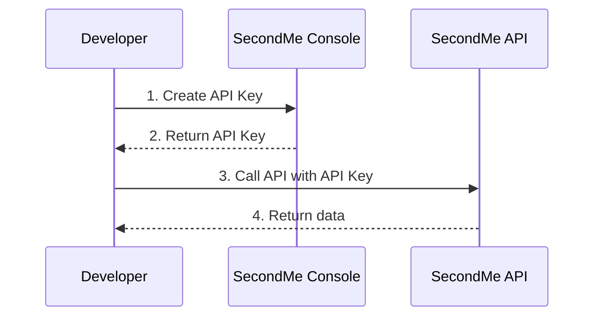
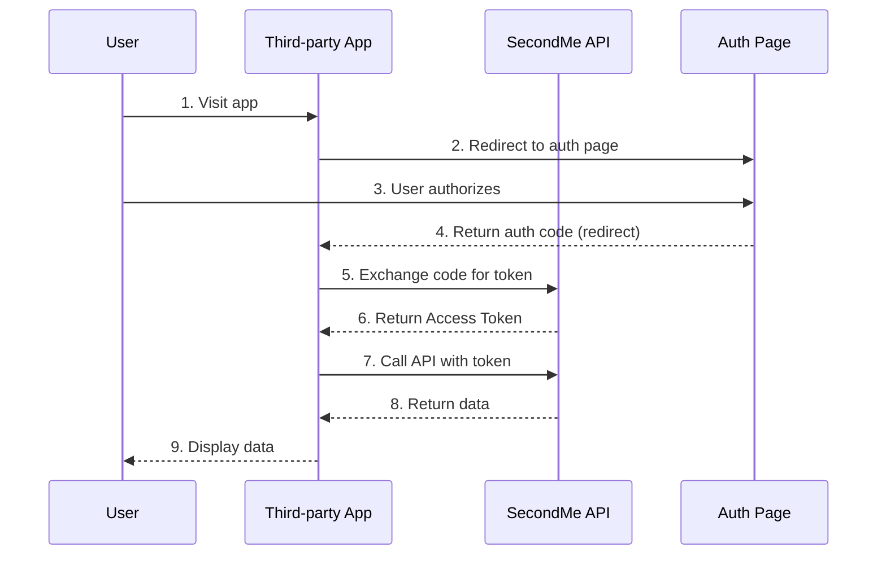

SecondMe API supports two authentication methods: **API Key** and **OAuth2**. Choose the right method based on your use case.

## Authentication Methods Comparison

| Feature | API Key | OAuth2 |
|---------|---------|--------|
| **Use Case** | Server-side calls, backend services, automation scripts | Third-party app integration, user authorization required |
| **User Interaction** | No user involvement | Requires user authorization |
| **Permission Scope** | Fixed at creation time | Confirmed by user during authorization |
| **Validity** | Long-lived (configurable expiration) | Access Token 2 hours, Refresh Token 30 days |
| **Token Prefix** | `lba_ak_` | `lba_at_` (Access Token) |
| **Revocation** | Delete API Key | User revokes authorization |

## How to Choose?

### Use API Key When:

- You're developing your own backend service
- You don't need to act on behalf of other users
- You need long-term stable access credentials
- You're using automation scripts or scheduled tasks

### Use OAuth2 When:

- You're developing a user-facing third-party application
- You need to access other users' data
- You need users to explicitly authorize your application
- You need to follow standard authorization flows

## Authentication Flow Diagrams

### API Key Authentication Flow



### OAuth2 Authorization Code Flow



## Request Header Format

Both authentication methods pass credentials via the `Authorization` header:

```http
Authorization: Bearer <token>
```

Where `<token>` can be:
- API Key: `lba_ak_xxxxx...`
- OAuth2 Access Token: `lba_at_xxxxx...`

## Permissions (Scopes)

Both authentication methods use the same permission system. When creating an API Key or requesting OAuth2 authorization, you need to specify required permissions:

| Scope | Description | Category |
|-------|-------------|----------|
| `user.info.name` | Access user's name | Basic Info |
| `user.info.email` | Access user's email | Basic Info |
| `user.info.phone` | Access user's phone | Basic Info |
| `user.info.avatar` | Access user's avatar | Basic Info |
| `user.info.bio` | Access user's bio | Extended Profile |
| `user.info.selfIntroduction` | Access user's self introduction | Extended Profile |
| `user.info.voiceId` | Access user's voice ID | Extended Profile |
| `user.info.profileCompleteness` | Access profile completeness | Extended Profile |
| `user.info.shades` | Access user's shade settings | Extended Profile |
| `user.info.softmemory` | Access user's soft memories | Basic Info |
| `chat` | Access chat functionality | Chat |

**Note**: API Key also supports wildcard `*` for all permissions. OAuth2 does not support wildcards.

## Next Steps

- [API Key Guide](/en/docs/authentication/api-key) - Learn how to create and use API Keys
- [OAuth2 Guide](/en/docs/authentication/oauth2) - Learn how to implement OAuth2 authorization flow
