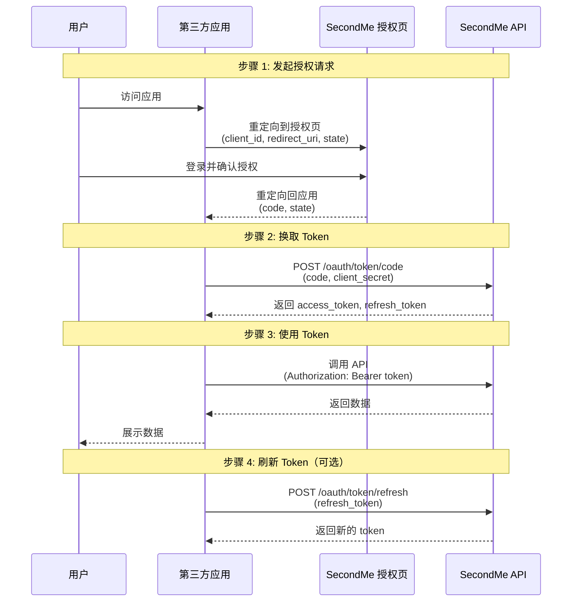

OAuth2 允许第三方应用在用户授权后访问其 MindVerse 数据。本指南介绍如何实现标准的授权码流程。

## 概述

SecondMe API 使用标准的 OAuth2 授权码流程 (Authorization Code Flow)：

1. 用户被重定向到 MindVerse 授权页面
2. 用户确认授权
3. MindVerse 返回授权码到你的应用
4. 你的应用用授权码换取 Access Token
5. 使用 Access Token 调用 API

## 授权流程时序图

下图展示了完整的 OAuth2 授权码流程：



## 前提条件

在开始之前，你需要：

1. 在 MindVerse SecondMe后台注册应用
2. 获取 `client_id` 和 `client_secret`
3. 配置回调 URL (Redirect URI)

## 令牌类型和有效期

| 令牌类型 | 前缀 | 有效期 |
|---------|------|--------|
| Authorization Code | `lba_ac_` | 5 分钟 |
| Access Token | `lba_at_` | 2 小时 |
| Refresh Token | `lba_rt_` | 30 天 |

## 授权流程

### 步骤 1: 发起授权请求

引导用户访问 SecondMe 授权页面进行登录和授权。

将用户重定向到 SecondMe 授权页面：

```
https://go.second.me/oauth/?client_id=YOUR_CLIENT_ID&redirect_uri=YOUR_REDIRECT_URI&response_type=code&state=RANDOM_STATE
```

**授权 URL 参数:**

| 参数 | 类型 | 必需 | 说明 |
|------|------|------|------|
| client_id | string | 是 | 应用的 Client ID |
| redirect_uri | string | 是 | 授权后的回调 URL，必须与应用配置一致 |
| response_type | string | 是 | 固定值 `code` |
| state | string | 是 | CSRF 保护参数，建议使用随机字符串 |

**前端示例代码:**

```javascript
// 构建授权 URL
function buildAuthorizationUrl() {
  const params = new URLSearchParams({
    client_id: 'your_client_id',
    redirect_uri: 'https://your-app.com/callback',
    response_type: 'code',
    state: generateRandomState()  // 生成随机 state 并存储用于验证
  });
  return `https://go.second.me/oauth/?${params.toString()}`;
}

// 发起授权 - 方式1: 直接跳转
window.location.href = buildAuthorizationUrl();

// 发起授权 - 方式2: 新窗口打开
window.open(buildAuthorizationUrl(), '_blank');
```

用户在 SecondMe 完成登录和授权后，会被重定向回你的 `redirect_uri`，URL 中包含授权码：

```
https://your-app.com/callback?code=lba_ac_xxxxx...&state=your_state
```

> **重要**: 收到回调后，务必验证 `state` 参数与发起请求时存储的值一致，以防止 CSRF 攻击。

### 步骤 2: 用授权码换取 Token

收到授权码后，在服务端用授权码换取 Access Token：

```bash
curl -X POST "https://app.mindos.com/gate/lab/api/oauth/token/code" \
  -H "Content-Type: application/x-www-form-urlencoded" \
  -d "grant_type=authorization_code" \
  -d "code=lba_ac_xxxxx..." \
  -d "redirect_uri=https://your-app.com/callback" \
  -d "client_id=your_client_id" \
  -d "client_secret=your_client_secret"
```

> **注意**: 必须使用 `application/x-www-form-urlencoded` 格式发送请求体，不能使用 JSON 格式（`application/json`）。使用错误的格式会导致 `Field required` 验证错误。

**请求参数:**

| 参数 | 类型 | 必需 | 说明 |
|------|------|------|------|
| grant_type | string | 是 | 固定值 `authorization_code` |
| code | string | 是 | 步骤 1 获取的授权码 |
| redirect_uri | string | 是 | 必须与步骤 1 中的值一致 |
| client_id | string | 是 | 应用的 Client ID |
| client_secret | string | 是 | 应用的 Client Secret |

**成功响应:**

```json
{
  "code": 0,
  "data": {
    "accessToken": "lba_at_xxxxx...",
    "refreshToken": "lba_rt_xxxxx...",
    "tokenType": "Bearer",
    "expiresIn": 7200,
    "scope": ["user.info", "chat"]
  }
}
```

### 步骤 3: 使用 Access Token

在 API 请求中使用 Access Token：

```bash
curl -X GET "https://app.mindos.com/gate/lab/api/secondme/user/info" \
  -H "Authorization: Bearer lba_at_xxxxx..."
```

### 步骤 4: 刷新 Access Token

当 Access Token 过期时，使用 Refresh Token 获取新的 Access Token：

```bash
curl -X POST "https://app.mindos.com/gate/lab/api/oauth/token/refresh" \
  -H "Content-Type: application/x-www-form-urlencoded" \
  -d "grant_type=refresh_token" \
  -d "refresh_token=lba_rt_xxxxx..." \
  -d "client_id=your_client_id" \
  -d "client_secret=your_client_secret"
```

> **注意**: 必须使用 `application/x-www-form-urlencoded` 格式发送请求体，不能使用 JSON 格式（`application/json`）。使用错误的格式会导致 `Field required` 验证错误。

**请求参数:**

| 参数 | 类型 | 必需 | 说明 |
|------|------|------|------|
| grant_type | string | 是 | 固定值 `refresh_token` |
| refresh_token | string | 是 | 之前获取的 Refresh Token |
| client_id | string | 是 | 应用的 Client ID |
| client_secret | string | 是 | 应用的 Client Secret |

**成功响应:**

```json
{
  "code": 0,
  "data": {
    "accessToken": "lba_at_new_token...",
    "refreshToken": "lba_rt_new_token...",
    "tokenType": "Bearer",
    "expiresIn": 7200,
    "scope": ["user.info", "chat"]
  }
}
```

> **注意**: 刷新 Token 时会同时轮换 Refresh Token，旧的 Refresh Token 将失效。

## 权限 (Scope)

请求授权时需要指定权限列表。用户可以看到你的应用请求的权限，并决定是否授权。

| 权限 | 说明 |
|------|------|
| `user.info` | 访问用户基础信息（姓名、邮箱、头像等） |
| `user.info.shades` | 访问用户兴趣标签 |
| `user.info.softmemory` | 访问用户软记忆 |
| `note.add` | 添加笔记和记忆 |
| `chat` | 访问聊天功能 |
| `voice` | 使用语音功能 |

**最佳实践**: 只请求必要的权限，避免请求过多权限导致用户拒绝授权。

## 错误处理

### 授权码无效或过期

```json
{
  "code": 400,
  "message": "授权码无效或已过期",
  "subCode": "oauth2.code.invalid"
}
```

### Client Secret 错误

```json
{
  "code": 401,
  "message": "Client Secret 不匹配",
  "subCode": "oauth2.client.secret_mismatch"
}
```

### Redirect URI 不匹配

```json
{
  "code": 400,
  "message": "Redirect URI 不匹配",
  "subCode": "oauth2.redirect_uri.mismatch"
}
```

### Access Token 过期

```json
{
  "code": 401,
  "message": "Access Token 已过期",
  "subCode": "oauth2.token.expired"
}
```

## 安全最佳实践

### 1. 保护 Client Secret

Client Secret 必须保密，只能在服务端使用，不要在客户端代码中暴露。

### 2. 验证 Redirect URI

确保 Redirect URI 使用 HTTPS，并且已在SecondMe后台注册。

### 3. 安全存储 Token

- 服务端存储时加密 Token
- 不要在日志中记录 Token
- 设置合适的过期时间

## 下一步

- [OAuth2 API 参考](/zh/docs/api-reference/oauth) - 查看完整 API 规格
- [SecondMe API 参考](/zh/docs/api-reference/secondme) - 了解可用的 API 接口
- [错误码参考](/zh/docs/errors) - 了解所有错误码
